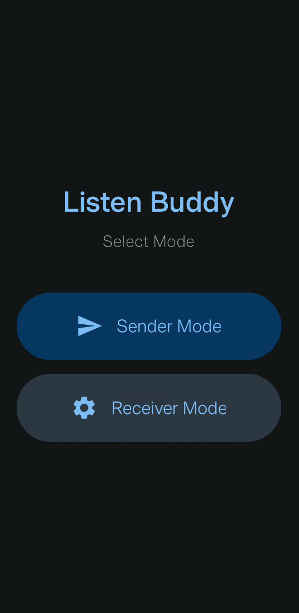
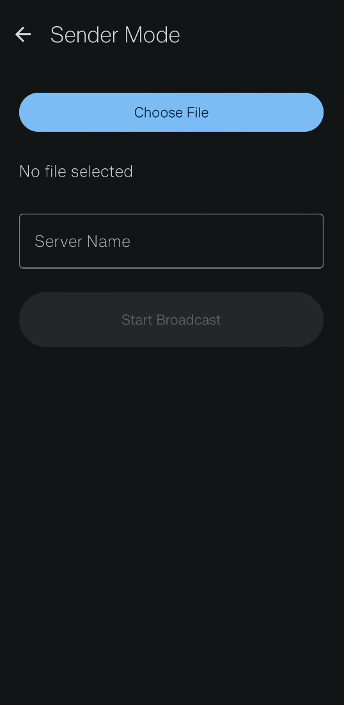
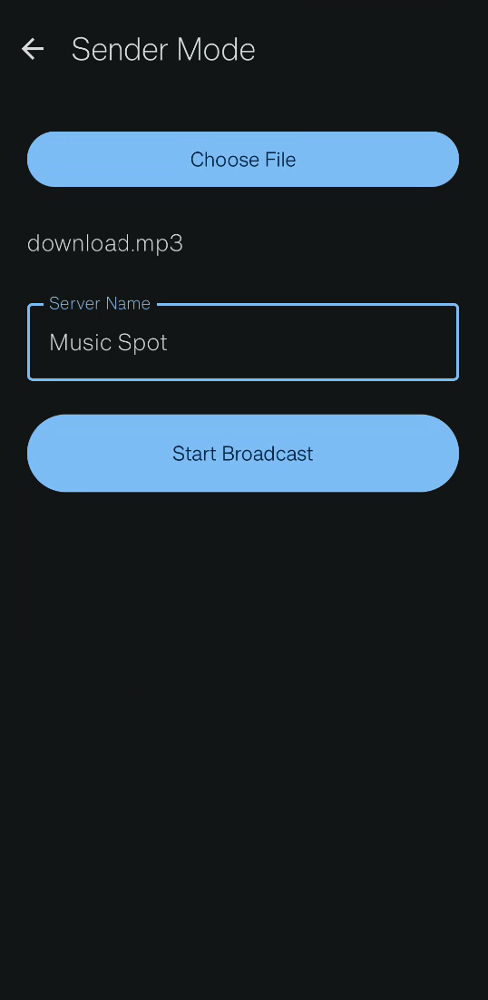
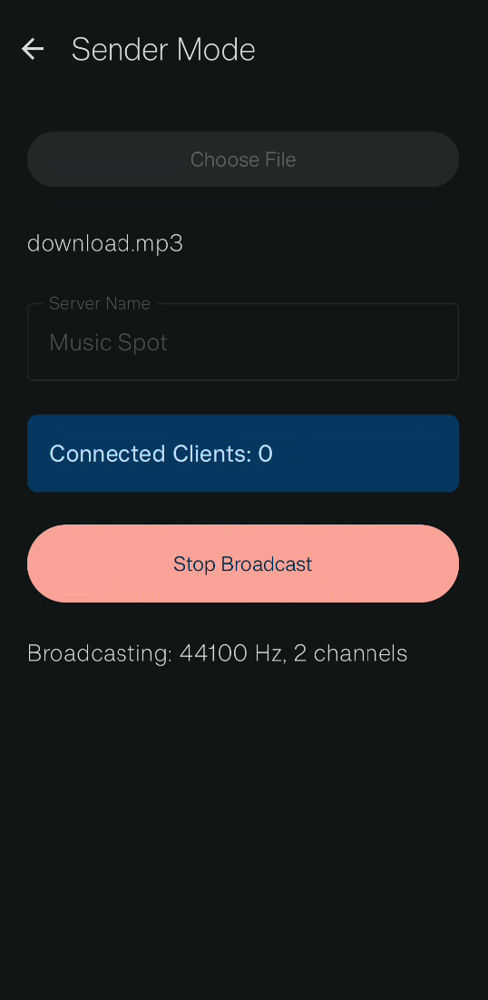
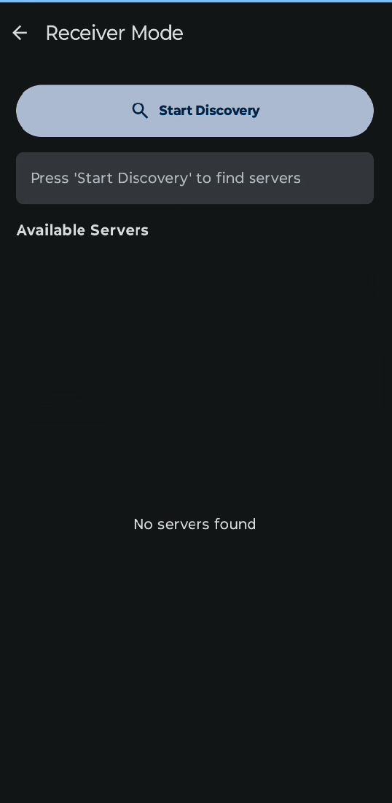
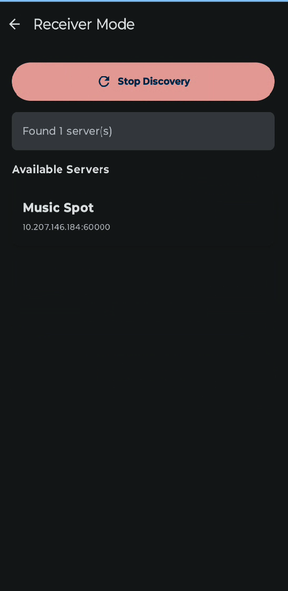
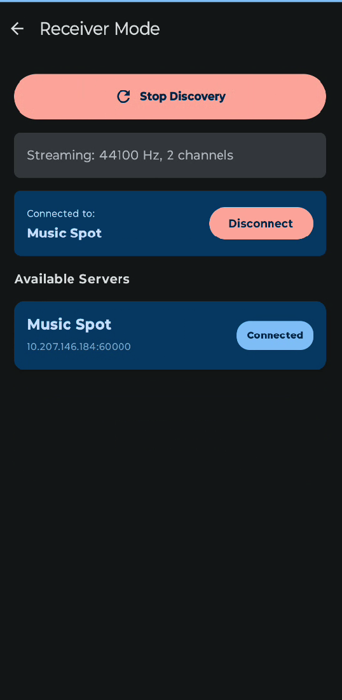

# 🎧 Listen-Buddy

**Listen-Buddy** is a local Wi-Fi based Android music sharing
application that allows multiple users connected to the same network to
listen to music together --- completely **without internet access**.

The application uses **UDP for device discovery** and **TCP for
synchronized playback streaming**, ensuring reliable audio data transfer
and real-time playback consistency between sender and receiver devices.

Built using **Modern Android Development (MAD)** principles, the app
follows **MVVM architecture**, leverages **Kotlin Coroutines** for
concurrency, and uses **Jetpack Compose** for UI.

------------------------------------------------------------------------

# 🚀 Features

## 🔍 Device Discovery (UDP Based)

-   Automatic peer discovery on the same Wi-Fi network
-   No manual IP configuration required
-   Lightweight broadcast-based detection

## 🎵 Synchronized Audio Streaming (TCP Based)

-   Reliable TCP socket connection for audio transfer
-   Real-time playback synchronization
-   Sender and receiver hear the same audio at the same time

## 🧠 Modern Android Architecture

-   MVVM architecture pattern
-   ViewModel-driven state management
-   Coroutine-based asynchronous networking

## 🎨 Jetpack Compose UI

-   Fully declarative UI
-   Material 3 components
-   Navigation using Navigation Compose

## ⚡ Performance Oriented

-   Background thread networking via Coroutines
-   Minimal UI blocking
-   Efficient socket communication

------------------------------------------------------------------------

# 🏗 Architecture Overview

UI (Jetpack Compose) ↓ ViewModel ↓ Networking Layer ↙ ↘ UDP Discovery
TCP Streaming

------------------------------------------------------------------------

# 🧰 Technical Specifications

## 📱 Platform

-   Android (Min SDK 21+ recommended)

## 🧑‍💻 Language

-   Kotlin 2.0.21

## 🏛 Architecture

-   MVVM (Model-View-ViewModel)
-   Lifecycle-aware ViewModels
-   Kotlin Coroutines

## 🎨 UI Stack

-   Jetpack Compose (BOM 2024.09.00)
-   Material 3
-   Navigation Compose 2.9.7
-   Activity Compose 1.12.2

## 🧵 Concurrency

-   Kotlin Coroutines
-   Lifecycle Runtime KTX 2.10.0

## 🌐 Networking

-   UDP (DatagramSocket) → Device discovery
-   TCP (ServerSocket / Socket) → Audio streaming

## 🔌 Build Configuration

### Plugins

-   Android Gradle Plugin 8.13.2
-   Kotlin Android Plugin 2.0.21
-   Kotlin Compose Plugin 2.0.21

------------------------------------------------------------------------

# 🖼 Screenshots










------------------------------------------------------------------------

# 🛠 How to Build Locally

## 1️⃣ Prerequisites

-   Android Studio (Hedgehog or newer recommended)
-   JDK 11+
-   Two physical Android devices connected to same Wi-Fi

## 2️⃣ Clone Repository

``` bash
git clone https://github.com/himanshu7745/Listen-Buddy.git
cd Listen-Buddy
```

## 3️⃣ Open in Android Studio

-   File → Open
-   Select project folder
-   Wait for Gradle Sync to complete

## 4️⃣ Ensure Required Permissions

``` xml
<uses-permission android:name="android.permission.INTERNET" />
<uses-permission android:name="android.permission.ACCESS_NETWORK_STATE" />
<uses-permission android:name="android.permission.ACCESS_WIFI_STATE" />
<uses-permission android:name="android.permission.CHANGE_WIFI_MULTICAST_STATE" />
<uses-permission android:name="android.permission.READ_EXTERNAL_STORAGE" />
<uses-permission android:name="android.permission.READ_MEDIA_AUDIO" />
```

## 5️⃣ Run the Application

1.  Connect both devices to same Wi-Fi
2.  Install app on both devices
3.  Launch on both
4.  One selects Host Mode
5.  Other selects Join Mode
6.  Start listening together 🎧

------------------------------------------------------------------------

# 📦 Download APK

[⬇ Download Latest APK](https://github.com/himanshu7745/Listen-Buddy/releases/download/v1.0.0/app-release.apk)

------------------------------------------------------------------------

# 🌱 Future Scope

## Feature Enhancements

-   Queue-based multi-file streaming
-   Seek synchronization
-   Real-time audio visualizer

## Security Improvements

-   Encrypted TCP communication (TLS)
-   Session authentication
-   Device pairing confirmation

## Architectural Improvements

-   Repository pattern implementation
-   Hilt for Dependency Injection
-   Clean Architecture modularization
-   Improved unit test coverage

------------------------------------------------------------------------


# 📜 License

Copyright (c) 2026 Himanshu Mishra

The source code and associated documentation files for Listen-Buddy are licensed under the MIT License.
See the [LICENSE](./LICENSE) file for the full license text.
